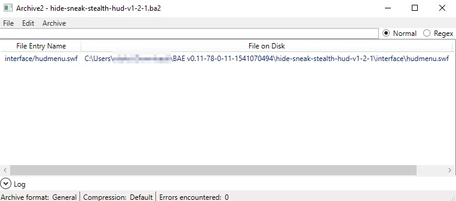

### Deployment

Save the new flash file on a directory, with the following format. The structure is crucial for the system to identify the HUD flash file:mod-root-directory/interface/hudemenu.swf

Use [Fallout 4 Creation Kit - Archive2](https://store.steampowered.com/app/1946160/Fallout_4_Creation_Kit/) to create the ba2 file. Once installed, this tool is located at `{user_defined_root}\steamapps\common\Fallout 4\Tools\Archive2`

